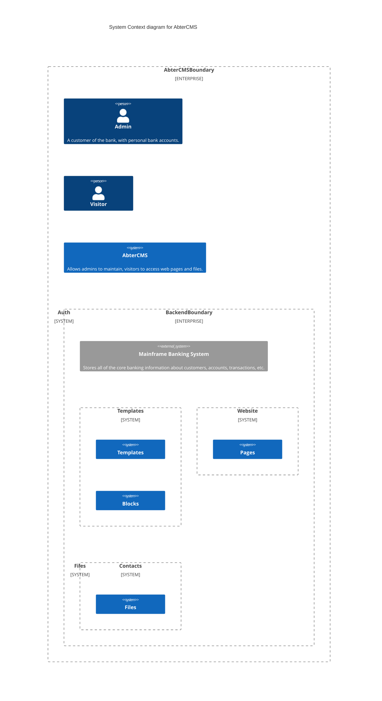

C4 System diagram
-----------------

```mermaid
    C4Context
    title System Context diagram for AbterCMS
    Enterprise_Boundary(b0, "AbterCMSBoundary") {
        Person(admin, "Admin", "A customer of the bank, with personal bank accounts.")
        Person(visitor, "Visitor")

        System(SystemAA, "AbterCMS", "Allows admins to maintain, visitors to access web pages and files.")

        System_Boundary(b1, "Auth") {
            System(SystemA, "Zitadel")
        }

        Enterprise_Boundary(b2, "BackendBoundary") {

            System_Ext(SystemE, "Mainframe Banking System", "Stores all of the core banking information about customers, accounts, transactions, etc.")

            System_Boundary(b3, "Templates") {
                System(SystemC, "Templates")
                System(SystemD, "Blocks")
            }

            System_Boundary(b4, "Website") {
                System(SystemA, "Redirects")
                System(SystemB, "Pages")
            }

            System_Boundary(b5, "Files") {
                System(SystemA, "Files")
            }

            System_Boundary(b6, "Contacts") {
                System(SystemA, "Forms")
                System(SystemA, "Files")
            }

%%            System_Ext(SystemC, "E-mail system", "The internal Microsoft Exchange e-mail system.")
%%            SystemDb(SystemD, "Banking System D Database", "A system of the bank, with personal bank accounts.")

%%            Boundary(b3, "BankBoundary3", "boundary") {
%%                SystemQueue(SystemF, "Banking System F Queue", "A system of the bank.")
%%                SystemQueue_Ext(SystemG, "Banking System G Queue", "A system of the bank, with personal bank accounts.")
%%            }
        }
    }

%%    BiRel(admin, SystemAA, "Uses")
%%    BiRel(visitor, SystemE, "Uses")
%%    Rel(SystemAA, SystemC, "Sends e-mails", "SMTP")
%%    Rel(SystemC, customerA, "Sends e-mails to")

%%      UpdateElementStyle(customerA, $fontColor="red", $bgColor="grey", $borderColor="red")
%%      UpdateRelStyle(customerA, SystemAA, $textColor="blue", $lineColor="blue", $offsetX="5")
%%      UpdateRelStyle(SystemAA, SystemE, $textColor="blue", $lineColor="blue", $offsetY="-10")
%%      UpdateRelStyle(SystemAA, SystemC, $textColor="blue", $lineColor="blue", $offsetY="-40", $offsetX="-50")
%%      UpdateRelStyle(SystemC, customerA, $textColor="red", $lineColor="red", $offsetX="-50", $offsetY="20")

%%      UpdateLayoutConfig($c4ShapeInRow="3", $c4BoundaryInRow="1")
```